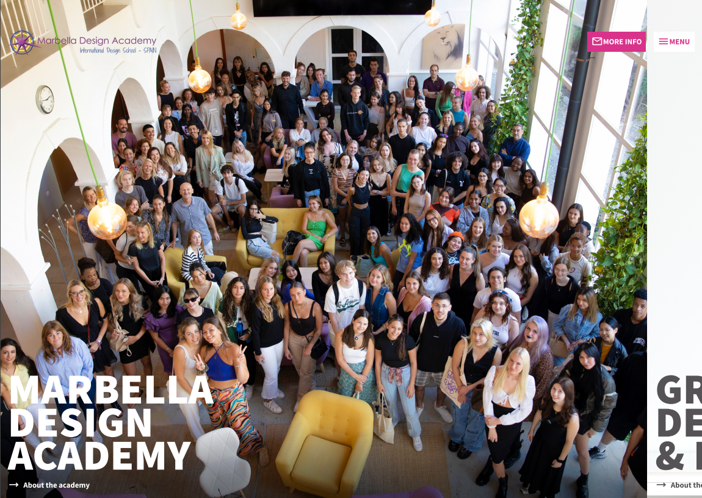

# MDA (Marbella Design Academy) - Kadence Child Theme

[![MDA Child Theme v0.9.0 badge][changelog-badge]][changelog] [![Version 0.9.0 Badge][version-badge]][changelog] [![Last commit badge][last-commit]][last-commit-link]

## Author:

Luis Colomé ( [@luiscolome](https://twitter.com/luiscolome) / [luiscolome.com](https://luiscolome.com) )

[Portfolio](https://luiscolome.com/)

## Summary

WordPress Starter Theme for use as Child Theme of Kadence Theme for building custom themes. Uses SCSS and PrePros to compile it. Tested up to WordPress 6.2.2 and Kadence 1.1.39.

## Usage

It is set up to use with [Prepros](https://prepros.io/) to complie the SCSS (with source maps). Javascript is minify (with source maps)

Rename folder to your theme name, change the `style.css` intro block to your theme information. Code as you will.

Please, keep in mind it is a working in progress project. I'm using the Theme in every project, so I would be changing, improving or even remove stuff in the future. Thank you :octocat:

### Features

1. SCSS with Prepros to compile it.
2. Easy to customize
3. Child theme tweaks
4. WordPress cleanup functions
5. ACF support

### Credits

-   [Vector image created by vectorpocket](https://www.freepik.es/vectorpocket)

Without these projects, this WordPress Genesis Starter Child Theme wouldn't be where it is today.

-   [SASS / SCSS](http://sass-lang.com/)
-   [Eduardo Boucas' Include Media Queries](https://eduardoboucas.github.io/include-media/)

[changelog]: ./CHANGELOG.md
[changelog-badge]: https://img.shields.io/badge/Changelog-MDA%20Child%20Theme%20v0.9.0-orange
[version-badge]: https://img.shields.io/badge/version-0.9.0-informational.svg
[last-commit]: https://img.shields.io/github/last-commit/luiscolome/marbelladesignacademy/main?color=yellow&logoColor=red
[last-commit-link]: https://github.com/LuisColome/marbelladesignacademy/commit/develop
